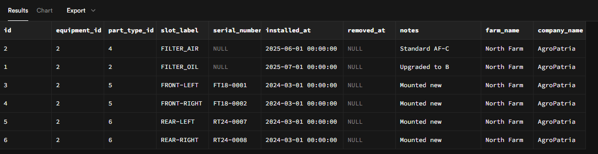
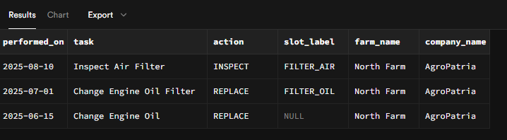
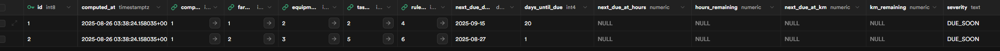

### Farmer Titan Equipment Maintenance Scheduling Database

#### 1) Overview

This schema powers a multi-tenant maintenance platform for farm equipment in **PostgreSQL 15 / Supabase**. It models companies, farms, equipment, component installations, maintenance tasks/rules, and complete maintenance traceability (including multi-component events).

#### 2) Core Domain Model

* **Company → Farm → Equipment**: standard multi-tenant hierarchy.
* **Equipment Model**: manufacturer/model/type; enables default rules across units.
* **Part Type**: catalog of part categories and SKUs.
* **Equipment Component**: a **physical part installed** on an equipment unit (with `installed_at` / `removed_at`); current state = rows where `removed_at IS NULL`. This provides both **current components** and **historical replacements**.

#### 3) Maintenance Catalog & Rules

* **Maintenance Task**: what to do (e.g., “Change Engine Oil Filter”), optionally with a default part type.
* **Maintenance Rule**: when/how often to do it. Supported frequencies:

  * Usage-based: `HOURS`, `KM`
  * Time-based: `DAYS`, `WEEKS`, `MONTHS`, `YEARS`
  * Advanced: `CRON` / `RRULE` patterns (stored as strings)
* **Scopes**: by **equipment**, by **equipment model**, or by **part type** (applies when that part type is actively installed). This handles manufacturer defaults and unit-specific overrides. To represent “whichever comes first” (e.g., 100 hours **or** 3 months), define two rules for the same task.

#### 4) Maintenance Events (Header + Details)

* **`maintenance_log` (header)**: records one event (date, task, meters, technician).

  * Optional `equipment_component_id` when the event clearly affects a **single** component (1:1 shortcut).
  * Optional `part_type_id` for consumables not modeled as components (e.g., engine oil).
* **`maintenance_log_detail` (lines)**: exact actions on components:

  * `equipment_component_id`, `action` (`REPLACE`, `REPAIR`, `INSPECT`, `CLEAN`, …)
  * `old_part_type_id` / `new_part_type_id`, `qty_used`
  * Supports **multi-component** operations (e.g., tire rotation).

This pattern keeps the header compact while guaranteeing granular traceability in the details.

#### 5) Example Queries (with farm & company joins)

**A. Current components for an equipment**

```sql
SELECT ec.*, f.name AS farm_name, c.name AS company_name
FROM equipment_component ec
JOIN equipment e ON e.id = ec.equipment_id
JOIN farm f ON f.id = e.farm_id
JOIN company c ON c.id = f.company_id
WHERE ec.equipment_id = :eq_id
  AND ec.removed_at IS NULL;
```


**B. Maintenance timeline for an equipment**

```sql
SELECT ml.performed_on,
       t.name AS task,
       d.action,
       ec.slot_label,
       f.name AS farm_name,
       c.name AS company_name
FROM maintenance_log ml
JOIN equipment e  ON e.id = ml.equipment_id
JOIN farm f       ON f.id = e.farm_id
JOIN company c    ON c.id = f.company_id
JOIN maintenance_task t ON t.id = ml.task_id
LEFT JOIN maintenance_log_detail d ON d.maintenance_log_id = ml.id
LEFT JOIN equipment_component ec    ON ec.id = d.equipment_component_id
WHERE ml.equipment_id = :eq_id
ORDER BY ml.performed_on DESC;
```


**C. Time-based tasks due in next 30 days**

```sql
WITH last_done AS (
  SELECT equipment_id, task_id, MAX(performed_on) AS last_date
  FROM maintenance_log
  GROUP BY equipment_id, task_id
)
SELECT c.name AS company_name,
       f.name AS farm_name,
       e.display_name AS equipment,
       t.name AS task,
       (COALESCE(ld.last_date, e.created_at::date) 
        + (r.value_numeric || ' months')::interval)::date AS next_due
FROM equipment e
JOIN farm f ON f.id = e.farm_id
JOIN company c ON c.id = f.company_id
JOIN maintenance_rule r ON r.active
JOIN maintenance_task t ON t.id = r.task_id
LEFT JOIN last_done ld ON ld.equipment_id = e.id AND ld.task_id = t.id
WHERE r.frequency_type = 'MONTHS'
  AND (COALESCE(ld.last_date, e.created_at::date) 
       + (r.value_numeric || ' months')::interval)::date
      <= current_date + interval '30 days';
```


#### 6) Supabase Automations

**A. Trigger: one active component per slot**
Keeps data consistent by automatically closing any previously active component in the same `(equipment, slot_label)` before inserting a new one.

* **Function**: `fn_close_previous_equipment_component`
* **Trigger**: `trg_close_previous_component` (BEFORE INSERT on `equipment_component`)
* **Behavior**: sets `removed_at` on any active row for the same equipment+slot.

**B. Trigger: auto-detail for single-component logs**
If a log targets `equipment_component_id` and no detail is provided, auto-create a minimal `maintenance_log_detail` with `action='INSPECT'`. This keeps header and details in sync for 1:1 cases.

* **Function**: `fn_log_autodetail`
* **Trigger**: `trg_log_autodetail` (AFTER INSERT on `maintenance_log` when `equipment_component_id IS NOT NULL`)

> Both triggers are optional; enable them if they match your workflow.

#### 7) Due-Soon Snapshot

Production systems benefit from a fast “what’s due” table:

* `due_soon` keeps one row per `(equipment, task, rule)` currently **OVERDUE** or **DUE\_SOON**.
* Function `refresh_due_soon_upsert(days, hours, km, purge)` computes and **UPSERTs** into the snapshot.
* Schedule with `pg_cron` (e.g., daily at 02:05).
* Add FKs to `company`, `farm`, `equipment`, `maintenance_task`, `maintenance_rule` for referential integrity.



#### 8) Scalability

* Index all foreign keys and `performed_on`.
* Optional **yearly partitioning** of `maintenance_log` and `maintenance_log_detail` by `performed_on` in PostgreSQL (documented approach: composite PK/FK with date). This improves pruning, speeds up queries, and simplifies archival.

#### 9) Why this design

* **Flexible**: single-component and multi-component events coexist naturally.
* **Traceable**: full lifecycle of components and precise actions.
* **Performant**: clean joins for org scoping; optional snapshot and partitioning for scale.
* **Extensible**: easy to link future inventory or IoT signals to part types and components.


## Additional Information

### Supabase instance

jdbc:postgresql://aws-1-us-east-2.pooler.supabase.com:5432/postgres?user=postgres.tzrqvkvresxxfladjran&password=[PASSWORD]

### EDR (To better understand the schema)

[](https://dbdiagram.io/d/FarmerTitan-68ac861f1e7a61196781f7be)
